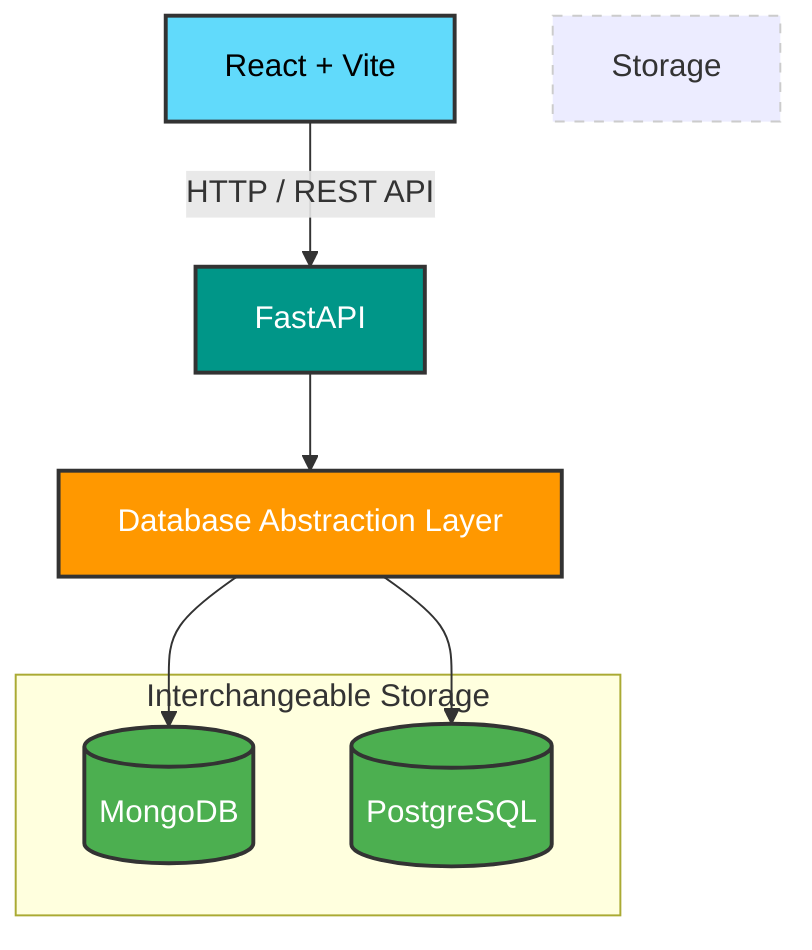

# NoteFlow

NoteFlow is a full-stack note-taking application built with **React, FastAPI, MongoDB, and PostgreSQL**.

## Features

- User registration and login
- JWT-based authentication
- Secure password hashing
- Create, view, update, and delete notes
- Search notes
- Tags for organizing notes
- Pagination
- Comments on notes
- Upvote and remove upvote
- User profiles and statistics
- Admin functionality
- Role-based authorization
- MongoDB or PostgreSQL database backend
- Database switching through `.env`
- PostgreSQL seed data

## Tech Stack

| Layer | Technology |
|---|---|
| Frontend | React, Vite, JavaScript, CSS |
| Backend | Python, FastAPI, Pydantic |
| Authentication | JWT, OAuth2 |
| Database | MongoDB, PostgreSQL |
| ORM | SQLAlchemy |
| PostgreSQL Driver | Psycopg 3 |
| Server | Uvicorn |
| Version Control | Git/GitHub |

## Database Switching

The backend supports both databases.

In `backend/.env`:

```env
DATABASE_TYPE=mongodb
```

uses the existing MongoDB database.

```env
DATABASE_TYPE=postgresql
```

uses PostgreSQL.

The FastAPI routes are database-independent. The database layer chooses the correct implementation.

## MongoDB

Default configuration:

```env
MONGO_URL=mongodb://localhost:27017
MONGO_DATABASE=notes_db
```

## PostgreSQL

Example:

```env
POSTGRES_USER=postgres
POSTGRES_PASSWORD=your_password
POSTGRES_HOST=localhost
POSTGRES_PORT=5432
POSTGRES_DATABASE=noteflow
```

Create the PostgreSQL database first:

```sql
CREATE DATABASE noteflow;
```

Then install backend dependencies:

```bash
pip install -r requirements.txt
```

When PostgreSQL mode is selected, NoteFlow automatically creates these tables:

- `users`
- `notes`
- `comments`
- `votes`

The schema uses primary keys, foreign keys, unique constraints and indexes.

## Seed PostgreSQL

Set:

```env
DATABASE_TYPE=postgresql
```

Then from `backend`:

```bash
python ../seed_postgresql.py
```

Sample users are created with:

```text
password123
```

## Run Backend

From `backend`:

```bash
uvicorn main:app --reload
```

The root endpoint shows the active database:

```text
GET /
```

Example:

```json
{
  "message": "My Notes API is working!",
  "database": "postgresql"
}
```

## Create Admin

From the project root:

```bash
python create_admin.py
```

Default admin:

```text
username: admin
password: admin123
email: admin@noteflow.local
```

Change these credentials before using the project anywhere public.

## Architecture



The frontend and API endpoints remain the same while the database implementation changes underneath.
